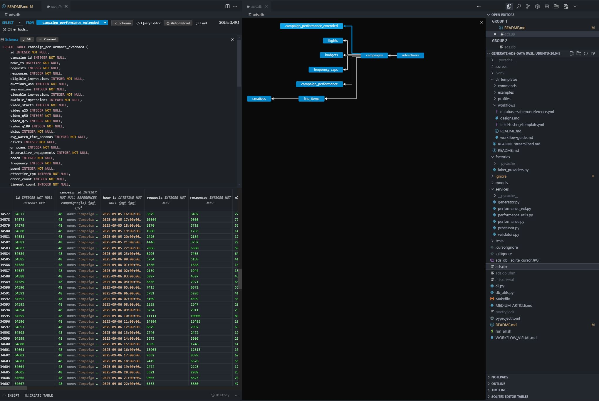
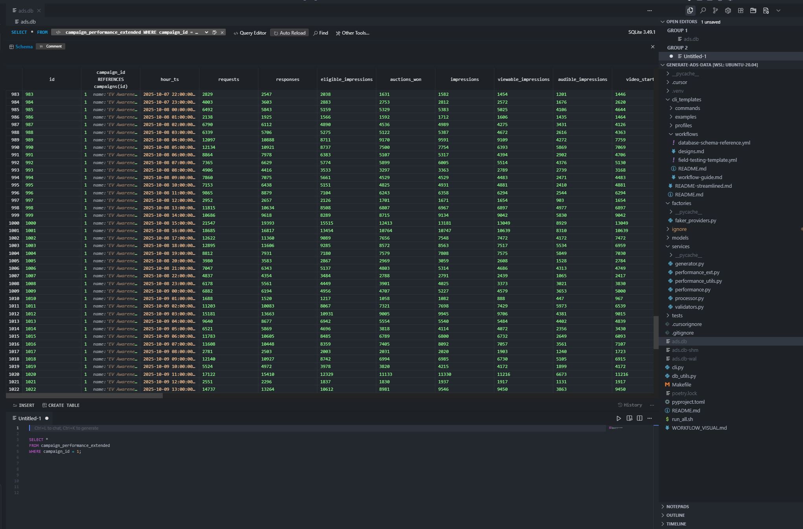

# 🚀 Generate Realistic Netflix Ads Data: A Complete Guide for Data Engineers

*Build a comprehensive ads analytics platform with realistic performance data, smart constraints, and strategic campaign profiles*

---

## 📖 Table of Contents

1. [Overview](#overview)
2. [Installation & Setup](#installation--setup)
3. [Generating Netflix Ads Data](#generating-netflix-ads-data)
4. [Querying Your Data](#querying-your-data)
5. [Advanced Analytics Examples](#advanced-analytics-examples)
6. [Architecture & Design](#architecture--design)
7. [Conclusion](#conclusion)

---

## 🎯 Overview

This platform generates **realistic Netflix ads data** for testing, development, and analytics. It creates comprehensive campaign data including:

- **Advertisers & Campaigns** with realistic targeting and budgets
- **Performance Metrics** (CTR, CPM, viewability, video completion rates)
- **Extended Analytics** (audience insights, supply funnel efficiency, auction performance)
- **Strategic Campaign Profiles** (Gain Market Share vs Defend Market Share)

Perfect for:
- 🧪 Testing ads analytics pipelines
- 📊 Building dashboards and reports
- 🎓 Learning about digital advertising metrics
- 🚀 Prototyping new analytics features

---

## 🛠️ Installation & Setup

### Prerequisites

- Python 3.10+
- Git
- Cursor IDE (recommended for SQLite3 editor integration)

### Step 1: Clone the Repository

```bash
git clone https://github.com/your-username/generate-ads-data.git
cd generate-ads-data
```

### Step 2: Install Dependencies

```bash
# Using Poetry (recommended)
poetry install

# Or using pip
pip install -r requirements.txt
```

### Step 3: Initialize the Database

```bash
python cli.py init-db
```

### Step 4: Install SQLite3 Editor in Cursor

For the best experience querying your data, install the [SQLite3 Editor extension](https://marketplace.cursorapi.com/items/?itemName=yy0931.vscode-sqlite3-editor) in Cursor:

1. Open Cursor IDE
2. Go to Extensions (Ctrl+Shift+X)
3. Search for "SQLite3 Editor"
4. Install the extension by yy0931

This extension provides:
- 📊 Visual table browsing
- 🔍 SQL query editor with syntax highlighting
- 📈 Data export capabilities
- 🎨 Intuitive interface for exploring your database

---

## 🚀 Generating Netflix Ads Data

### Quick Start: Generate Everything

```bash
# Generate complete dataset in one command
./run_all.sh
```

This single command creates:
- 3 Complete Examples (Luxury Auto, Crunchy Snacks, NexBank)
- 4 Campaign Profiles (High CPM, Mobile, Interactive, Multi-device)
- 7 Strategic Profiles (Gain Market Share vs Defend Market Share)
- Performance data for all campaigns (6,000+ rows)

### Step-by-Step Generation

#### 1. Create Examples

```bash
# Create luxury auto awareness campaign
python cli.py create-example \
  --template cli_templates/examples/netflix-ads-examples.yml \
  --example luxury_auto_awareness

# Create crunchy snacks consideration campaign
python cli.py create-example \
  --template cli_templates/examples/netflix-ads-examples.yml \
  --example crunchy_snacks_consideration

# Create NexBank conversion campaign
python cli.py create-example \
  --template cli_templates/examples/netflix-ads-examples.yml \
  --example nexbank_conversion
```

#### 2. Create Campaign Profiles

```bash
# High CPM TV awareness campaigns
python cli.py create-profile --name high_cpm_tv_awareness

# Mobile consideration campaigns
python cli.py create-profile --name mobile_consideration

# Interactive conversion campaigns
python cli.py create-profile --name conversion_interactive

# Multi-device advanced campaigns
python cli.py create-profile --name multi_device_advanced
```

#### 3. Create Strategic Profiles

```bash
# Gain Market Share: Expansion campaigns
python cli.py create-profile --name high_cpm_tv_awareness
python cli.py create-profile --name mobile_consideration
python cli.py create-profile --name conversion_interactive

# Defend Market Share: Retention campaigns
python cli.py create-profile --name high_cpm_tv_awareness
python cli.py create-profile --name mobile_consideration
python cli.py create-profile --name conversion_interactive
python cli.py create-profile --name multi_device_advanced
```

### What Gets Generated

Each campaign creates:
- **Advertiser** with realistic company details
- **Campaign** with targeting and budget
- **Line Items** with ad formats and placements
- **Creatives** with video specs and interactive elements
- **Performance Data** (hourly metrics for 7+ days)
- **Extended Metrics** (viewability, completion rates, audience insights)

---

## 🔍 Querying Your Data

### Understanding Your Database Schema

Before diving into queries, let's understand the database structure. The platform creates a comprehensive schema with realistic Netflix ads data:



**Key Table Relationships:**
- **`advertisers`** → **`campaigns`** (one-to-many)
- **`campaigns`** → **`line_items`** (one-to-many) 
- **`campaigns`** → **`creatives`** (one-to-many)
- **`campaigns`** → **`performance`** (one-to-many)
- **`campaigns`** → **`performance_ext`** (one-to-many)

**What Each Table Contains:**
- **`advertisers`**: Company information, industry, brand details
- **`campaigns`**: Campaign objectives, budgets, targeting, status
- **`line_items`**: Ad formats, placements, delivery settings, targeting JSON
- **`creatives`**: Video specs, interactive elements, QA status, file properties
- **`performance`**: Hourly metrics (impressions, clicks, spend, CTR, CPM)
- **`performance_ext`**: Extended metrics (viewability, completion rates, supply funnel)

### Opening Your Database in Cursor

1. **Open the database file**:
   - Right-click on `ads.db` in Cursor's file explorer
   - Select "Open With..." → "SQLite3 Editor"

2. **Explore the schema**:
   - Tables are automatically loaded in the left sidebar
   - Click on any table to see its structure and sample data



### Basic Queries

#### 1. Campaign Overview

```sql
SELECT 
    c.id,
    c.name,
    c.objective,
    c.target_cpm,
    c.budget,
    a.name as advertiser_name,
    a.industry
FROM campaigns c
JOIN advertisers a ON c.advertiser_id = a.id
ORDER BY c.budget DESC;
```

#### 2. Performance Summary

```sql
SELECT 
    c.name as campaign_name,
    COUNT(p.id) as performance_records,
    AVG(p.ctr) as avg_ctr,
    AVG(p.cpm) as avg_cpm,
    SUM(p.impressions) as total_impressions,
    SUM(p.clicks) as total_clicks
FROM campaigns c
JOIN performance p ON c.id = p.campaign_id
GROUP BY c.id, c.name
ORDER BY total_impressions DESC;
```

#### 3. Extended Metrics Analysis

```sql
SELECT 
    c.name as campaign_name,
    AVG(ep.viewability_rate) as avg_viewability,
    AVG(ep.video_completion_rate) as avg_completion,
    AVG(ep.effective_cpm) as avg_effective_cpm,
    AVG(ep.supply_funnel_efficiency) as avg_funnel_efficiency
FROM campaigns c
JOIN performance_ext ep ON c.id = ep.campaign_id
GROUP BY c.id, c.name
HAVING avg_viewability > 0.7
ORDER BY avg_funnel_efficiency DESC;
```

### Advanced Analytics

#### 1. Campaign Performance by Objective

```sql
SELECT 
    c.objective,
    COUNT(DISTINCT c.id) as campaign_count,
    AVG(p.ctr) as avg_ctr,
    AVG(p.cpm) as avg_cpm,
    AVG(ep.viewability_rate) as avg_viewability,
    AVG(ep.video_completion_rate) as avg_completion
FROM campaigns c
JOIN performance p ON c.id = p.campaign_id
JOIN performance_ext ep ON c.id = ep.campaign_id
GROUP BY c.objective
ORDER BY avg_ctr DESC;
```

#### 2. Industry Performance Analysis

```sql
SELECT 
    a.industry,
    COUNT(DISTINCT c.id) as campaign_count,
    AVG(p.ctr) as avg_ctr,
    AVG(p.cpm) as avg_cpm,
    SUM(p.impressions) as total_impressions,
    SUM(p.spend) as total_spend
FROM advertisers a
JOIN campaigns c ON a.id = c.advertiser_id
JOIN performance p ON c.id = p.campaign_id
GROUP BY a.industry
ORDER BY total_spend DESC;
```

#### 3. Time-based Performance Trends

```sql
SELECT 
    DATE(p.timestamp) as date,
    HOUR(p.timestamp) as hour,
    AVG(p.ctr) as avg_ctr,
    AVG(p.cpm) as avg_cpm,
    SUM(p.impressions) as total_impressions,
    SUM(p.clicks) as total_clicks
FROM performance p
WHERE p.timestamp >= datetime('now', '-7 days')
GROUP BY DATE(p.timestamp), HOUR(p.timestamp)
ORDER BY date DESC, hour ASC;
```

---

## 📊 Advanced Analytics Examples

### 1. Supply Funnel Efficiency Analysis

```sql
-- Analyze how campaigns perform through the supply funnel
SELECT 
    c.name as campaign_name,
    AVG(ep.supply_funnel_efficiency) as funnel_efficiency,
    AVG(ep.auction_win_rate) as win_rate,
    AVG(ep.fill_rate) as fill_rate,
    AVG(ep.response_rate) as response_rate
FROM campaigns c
JOIN performance_ext ep ON c.id = ep.campaign_id
GROUP BY c.id, c.name
HAVING funnel_efficiency > 0.6
ORDER BY funnel_efficiency DESC;
```

### 2. Video Performance Deep Dive

```sql
-- Analyze video campaign performance
SELECT 
    c.name as campaign_name,
    AVG(ep.video_start_rate) as start_rate,
    AVG(ep.video_completion_rate) as completion_rate,
    AVG(ep.video_skip_rate) as skip_rate,
    AVG(ep.avg_watch_time_seconds) as avg_watch_time
FROM campaigns c
JOIN performance_ext ep ON c.id = ep.campaign_id
WHERE ep.video_starts > 0
GROUP BY c.id, c.name
ORDER BY completion_rate DESC;
```

### 3. Audience Insights Analysis

```sql
-- Analyze audience targeting effectiveness
SELECT 
    c.name as campaign_name,
    c.objective,
    JSON_EXTRACT(li.targeting_json, '$.DEVICE') as target_devices,
    JSON_EXTRACT(li.targeting_json, '$.CONTENT_GENRE') as target_genres,
    AVG(ep.reach) as avg_reach,
    AVG(ep.frequency) as avg_frequency
FROM campaigns c
JOIN line_items li ON c.id = li.campaign_id
JOIN performance_ext ep ON c.id = ep.campaign_id
GROUP BY c.id, c.name, li.targeting_json
ORDER BY avg_reach DESC;
```

---

## 🏗️ Architecture & Design

### Key Features

- **🔄 Registry Pattern**: Centralized access to all domain components
- **🛡️ Smart Constraints**: Data generation automatically satisfies database constraints
- **🧮 Safe Division**: Built-in protection against division by zero errors
- **📊 Realistic Data**: Faker-based generation with business logic
- **🎯 Strategic Profiles**: Pre-built campaigns for different business objectives

### Database Schema

The platform creates a comprehensive schema with:

- **`advertisers`**: Company information and industry
- **`campaigns`**: Campaign objectives, budgets, and targeting
- **`line_items`**: Ad formats, placements, and delivery settings
- **`creatives`**: Video specs, interactive elements, and QA status
- **`performance`**: Hourly metrics (impressions, clicks, spend, CTR, CPM)
- **`performance_ext`**: Extended metrics (viewability, completion rates, audience insights)

### Smart Data Generation

The platform ensures data quality through:

- **Constraint Satisfaction**: All generated data meets database CHECK constraints
- **Realistic Relationships**: Performance metrics follow logical business rules
- **Variety & Consistency**: Different campaign types with realistic variations
- **Time-based Patterns**: Hourly data that reflects real advertising patterns

---

## 🎉 Conclusion

This Netflix ads data generation platform provides everything you need to:

✅ **Build realistic ads analytics pipelines**  
✅ **Test new analytics features** with comprehensive data  
✅ **Learn about digital advertising metrics** through hands-on exploration  
✅ **Prototype dashboards and reports** with production-like data  
✅ **Understand campaign performance** across different objectives and industries  

### Next Steps

1. **Explore the data** using the SQLite3 Editor in Cursor
2. **Build custom queries** for your specific analytics needs
3. **Extend the platform** with new campaign types or metrics
4. **Integrate with your analytics stack** (dbt, Looker, Tableau, etc.)

### Resources

- 📚 [Platform Documentation](README.md)
- 🏗️ [Architecture Overview](WORKFLOW_VISUAL.md)
- 🧪 [Test Suite](tests/)
- 🔧 [CLI Commands](cli.py --help)

---

**Ready to dive into realistic Netflix ads data?** Clone the repository, run `./run_all.sh`, and start exploring with the SQLite3 Editor in Cursor! 🚀

---

*This platform demonstrates how to build production-ready data generation tools with smart constraints, realistic business logic, and comprehensive analytics coverage. Perfect for data engineers, analysts, and anyone interested in digital advertising metrics.*
