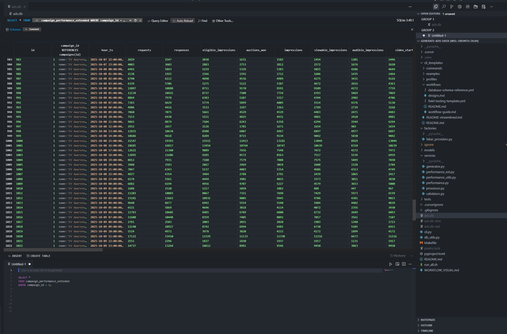
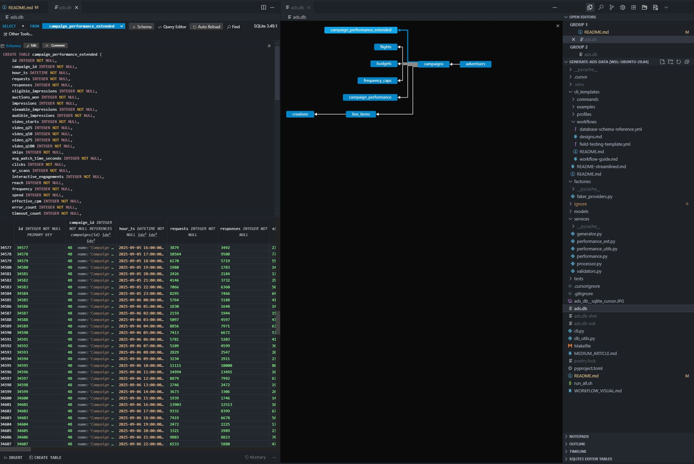

# 🚀 Netflix Ads Data Generation Platform

A comprehensive, production-ready platform for generating realistic Netflix ads data using modern Python technologies. Built with a centralized registry pattern for maintainability and extensibility, featuring an efficient performance generation system with zero code duplication and robust constraint handling.

## ✨ **Key Features**

- **🎯 Centralized Registry Pattern** - Single point of access to all models, schemas, and enums
- **🏗️ Modern Architecture** - SQLAlchemy 2.0, Pydantic v2, and comprehensive testing
- **📊 Rich Data Generation** - Realistic Netflix ads data with performance metrics
- **🔧 CLI-Driven Workflows** - Easy-to-use commands for data generation and management
- **🧪 Comprehensive Testing** - 18 tests covering all major functionality
- **📈 Performance Simulation** - Hourly performance data with realistic metrics
- **♻️ Zero Code Duplication** - Efficient performance generation with shared utilities
- **🧮 Smart Calculation** - Pydantic computed fields for derived metrics
- **🛡️ Robust Constraints** - Database-level integrity with smart data generation
- **🔒 Safe Division** - Built-in protection against division by zero errors
- **🔍 Visual Data Exploration** - SQLite3 Editor integration for easy database browsing

## 🏗️ **Architecture Overview**

### **Registry Pattern (`models/registry.py`)**
The heart of the system - a centralized registry that provides unified access to:
- **ORM Models** - SQLAlchemy database models
- **Pydantic Schemas** - Data validation and serialization
- **Enums & Constants** - Domain-specific values and configurations
- **Utility Functions** - Helper functions and validators

```python
from models.registry import registry

# Access anything through the registry
advertiser = registry.Advertiser(name="Netflix")
campaign = registry.CampaignCreate(name="Q4 Campaign")
mime_type = registry.CreativeMimeType.mp4
budget_type = registry.BudgetType.lifetime
```

### **Performance Generation Architecture**
The system uses a smart two-layer approach to eliminate code duplication:

#### **Layer 1: Raw Data Generation (`services/performance.py`)**
- Generates ALL performance data (basic + extended) in one place
- Includes temporal factors, supply funnel metrics, and quality indicators
- **Smart constraint handling** - ensures all database constraints are satisfied
- Single source of truth for all raw performance data
- Uses shared utilities for common operations

#### **Layer 2: Calculated Fields (`services/performance_ext.py`)**
- **NO data generation** - reads existing performance data
- Adds business intelligence through Pydantic computed fields
- Computes derived metrics like CTR, completion rates, viewability
- **Safe division handling** - uses `safe_div()` utility for all calculations
- Enriches existing data without duplication

#### **Shared Utilities (`services/performance_utils.py`)**
```python
# Common functions used by both performance modules:
- safe_div()                    # Safe division with zero protection
- get_campaign_and_flight()     # Campaign/flight data fetching
- clear_existing_performance()  # Data clearing
- batch_insert_performance()    # Batch insertion
- create_performance_row()      # Row creation with temporal fields
```

### **Core Components**
- **`models/orm.py`** - SQLAlchemy ORM models with constraints and relationships
- **`models/schemas.py`** - Pydantic v2 schemas for data validation
- **`models/enums.py`** - Domain enums and configuration constants
- **`services/`** - Business logic and data processing
- **`factories/`** - Data generation using Faker with registry access
- **`cli.py`** - Click-based command-line interface

## 📁 **Directory Structure**

```
generate-ads-data/
├── models/                     # Core domain models
│   ├── registry.py            # 🎯 Centralized registry
│   ├── orm.py                 # SQLAlchemy ORM models with extended fields
│   ├── schemas.py             # Pydantic validation schemas
│   ├── enums.py               # Domain enums and constants
│   └── __init__.py            # Registry-only exports
├── services/                   # Business logic
│   ├── processor.py # Main data generation service
│   ├── generator.py           # ORM payload creation
│   ├── performance.py         # 🚀 Complete performance data generation
│   ├── performance_ext.py     # 📊 Calculated fields only (no duplication)
│   ├── performance_utils.py   # 🔧 Shared utilities for performance
│   └── validators.py          # Cross-field validation
├── factories/                  # Data generation
│   └── faker_providers.py     # Faker providers using registry
├── cli_templates/             # CLI configuration templates
│   ├── examples/              # Netflix ads examples
│   ├── profiles/              # Campaign profiles
│   └── workflows/             # Workflow templates
├── tests/                     # Comprehensive test suite (18 tests)
├── cli.py                     # Main CLI application
├── db_utils.py                # Database utilities
├── run_all.sh                 # 🚀 Complete data generation script
└── Makefile                   # Development and testing commands
```

## 🚀 **Quick Start**

### **1. Setup Environment**
```bash
# Clone and setup
git clone <repository>
cd generate-ads-data

# Install dependencies
make deps
# or manually: python -m venv .venv && source .venv/bin/activate && pip install -r requirements.txt
```

### **2. Initialize Database**
```bash
make init-db
# or: python cli.py init-db
```

### **3. Generate Complete Dataset**
```bash
# Run the comprehensive data generation script
./run_all.sh

# This creates:
# ✅ 3 Complete Examples (Luxury Auto, Crunchy Snacks, NexBank)
# ✅ 4 Campaign Profiles (High CPM, Mobile, Interactive, Multi-device)
# ✅ Complete performance data for all campaigns (basic + extended)
# ✅ ~34MB SQLite database with realistic Netflix ads data
# ✅ All database constraints satisfied automatically
```

### **4. Individual Commands**
```bash
# Create advertiser
python cli.py create-advertiser --auto

# Create campaign
python cli.py create-campaign --advertiser-id 1 --auto

# Create from profile
python cli.py create-profile --name high_cpm_tv_awareness

# Create from example template
python cli.py create-example --template cli_templates/examples/netflix-ads-examples.yml --example luxury_auto_awareness
```

### **5. Explore Your Data with SQLite3 Editor**

For the best experience exploring your generated data, use the [SQLite3 Editor extension](https://marketplace.cursorapi.com/items/?itemName=yy0931.vscode-sqlite3-editor) in Cursor IDE:

1. **Install the extension** in Cursor (Ctrl+Shift+X → Search "SQLite3 Editor")
2. **Open your database** by right-clicking `ads.db` → "Open With..." → "SQLite3 Editor"
3. **Explore tables** in the left sidebar and run SQL queries



**What you'll see:**
- 📊 **Visual table browsing** with sample data
- 🔍 **SQL query editor** with syntax highlighting  
- 📈 **Data export capabilities** for further analysis
- 🎨 **Intuitive interface** for exploring campaign performance

**Database Schema:**
- 📋 **ERD Overview**: See the [Database Schema & Relationships](#database-schema--relationships) section above for the complete Entity Relationship Diagram
- 🔗 **Table Relationships**: Understand how advertisers, campaigns, line items, and performance data connect
- 📊 **Data Structure**: Learn what fields are available in each table for your queries

**Try these queries:**
```sql
-- Campaign overview
SELECT c.name, c.objective, c.budget, a.industry 
FROM campaigns c 
JOIN advertisers a ON c.advertiser_id = a.id;

-- Performance summary
SELECT c.name, AVG(p.ctr), SUM(p.impressions) 
FROM campaigns c 
JOIN performance p ON c.id = p.campaign_id 
GROUP BY c.id;
```

## 🗄️ **Database Schema & Relationships**

Now that you've generated data, let's understand the database structure. The platform creates a comprehensive schema with realistic Netflix ads data:



**Key Relationships:**
- **Advertisers** → **Campaigns** (one-to-many)
- **Campaigns** → **Line Items** (one-to-many) 
- **Campaigns** → **Creatives** (one-to-many)
- **Campaigns** → **Performance** (one-to-many)
- **Campaigns** → **Performance Extended** (one-to-many)

**Table Structure:**
- **`advertisers`**: Company information, industry, brand details
- **`campaigns`**: Campaign objectives, budgets, targeting, status
 
## 📚 Documentation (Sphinx)

Local usage
- Install dev deps: `poetry install`
- Live preview: `make docs-serve` (http://127.0.0.1:8000)
- Build once: `make docs-html` (opens `docs/_build/html/index.html`)
- Strict build (treat warnings as errors): `make docs-html-strict`

What gets rendered
- CLI help and options (sphinx-click): `docs/cli_commands.rst`
- Python API (autodoc + Napoleon): `docs/api/cli.rst`

Writing docs
- Use Google-style (Napoleon) docstrings (Args, Returns, Raises, Examples).
- New Click commands in `cli.py` show up automatically on the CLI page.
- If you add heavy service modules, consider adding them to `autodoc_mock_imports` in `docs/conf.py` to keep builds fast and reliable.

CI and production
- CI builds docs and runs tests on push/PR: `.github/workflows/docs-ci.yml`.
- When ready to publish docs:
  1) Enable GitHub Pages in repo settings.
  2) Add a deploy workflow that publishes `docs/_build/html` (see `docs/docs_guide.rst` for an example).

More details: `docs/docs_guide.rst`.
- **`line_items`**: Ad formats, placements, delivery settings, targeting JSON
- **`creatives`**: Video specs, interactive elements, QA status, file properties
- **`performance`**: Hourly metrics (impressions, clicks, spend, CTR, CPM)
- **`performance_ext`**: Extended metrics (viewability, completion rates, supply funnel)

**Understanding the Data Flow:**
1. **Advertisers** create campaigns with specific objectives and budgets
2. **Campaigns** contain line items that define ad formats and targeting
3. **Creatives** provide the actual ad content and specifications
4. **Performance** tracks hourly metrics and engagement data
5. **Performance Extended** adds business intelligence and derived metrics

This structure allows you to analyze campaigns from multiple angles:
- **Campaign Performance**: How campaigns perform over time
- **Industry Analysis**: Compare performance across different advertiser industries
- **Format Effectiveness**: Analyze which ad formats drive better results
- **Targeting Insights**: Understand audience engagement patterns

## 🎯 **Registry Pattern Benefits**

### **Before (Scattered Imports)**
```python
from models.enums import BudgetType, CreativeMimeType
from models.schemas import CreativeCreate
from models.orm import Advertiser, Campaign

# Usage scattered throughout code
BudgetType.lifetime.value
CreativeCreate(...)
Advertiser(...)
```

### **After (Unified Registry)**
```python
from models.registry import registry

# Everything through one interface
registry.BudgetType.lifetime.value
registry.CreativeCreate(...)
registry.Advertiser(...)
```

### **Key Advantages**
- **🔄 Single Source of Truth** - All domain components in one place
- **🔧 Easy Maintenance** - Change enums/schemas, affects everything automatically
- **🧹 Clean Imports** - One import statement instead of multiple
- **📈 Future-Proof** - Easy to add new properties or change implementations
- **🧪 Better Testing** - Centralized access makes mocking and testing easier

## 📊 **Performance Data Generation**

### **Smart Architecture - Zero Duplication**

#### **Single Data Generation Point**
```python
# All performance data generated in one place
from services.performance import generate_hourly_performance_raw

# This generates:
# ✅ Basic metrics: impressions, clicks, CTR, completion rates
# ✅ Extended metrics: supply funnel, video progression, quality metrics
# ✅ Temporal fields: hour_of_day, day_of_week, business_hours
# ✅ Audience data: device mix, demographics, interests
# ✅ Constraint-safe data: all database constraints automatically satisfied
```

#### **Calculated Fields Layer**
```python
# Add business intelligence without regenerating data
from services.performance_ext import add_extended_metrics_to_performance

# Computes derived metrics with safe division:
# 🧮 Viewability rates, completion percentages
# 🧮 Supply funnel efficiency, auction win rates
# 🧮 Effective CPM, average watch time
# 🧮 Error rates, timeout percentages
# 🛡️ Safe division handling for all calculations
```

### **Complete Examples**
- **Luxury Auto Awareness** - High-budget TV campaigns with premium targeting
- **Crunchy Snacks Consideration** - Mobile-focused campaigns with broad reach
- **NexBank Conversion** - Performance-driven campaigns with interactive elements

### **Campaign Profiles**
- **High CPM TV Awareness** - Premium content, large budgets, TV targeting
- **Mobile Consideration** - Mobile-first, comedy/reality content, short duration
- **Conversion Interactive** - Interactive elements, QR codes, business targeting
- **Multi-Device Advanced** - Cross-platform campaigns with advanced targeting

### **Performance Metrics Coverage**

#### **Basic Metrics (Generated)**
- **Impressions & Reach** - Total served, unique users
- **Engagement** - Clicks, CTR, completion rates
- **Quality** - Render rates, fill rates, response rates
- **Video** - Start rates, skip rates, progression tracking

#### **Extended Metrics (Generated)**
- **Supply Funnel** - Requests → Responses → Eligible → Auctions → Impressions
- **Video Progression** - Q25, Q50, Q75, Q100 completion tracking
- **Quality Indicators** - Viewability, audibility, error rates
- **Financial** - Spend tracking, effective CPM calculation

#### **Calculated Fields (Computed)**
- **Efficiency Metrics** - Fill rates, win rates, completion percentages
- **Business Intelligence** - Watch time estimates, engagement quality
- **Performance Ratios** - Error rates, timeout percentages, supply efficiency

## 🛡️ **Robust Constraint Handling**

### **Database Constraints Automatically Satisfied**

The system now automatically generates data that satisfies all database constraints:

```python
# Supply funnel constraints
responses >= 0.9 * requests                    # ✅ Automatically satisfied
eligible_impressions >= 0.8 * responses        # ✅ Automatically satisfied
auctions_won >= 0.8 * eligible_impressions    # ✅ Automatically satisfied

# Video progression constraints
video_q25 >= video_q50 >= video_q75 >= video_q100  # ✅ Automatically satisfied

# Performance constraints
viewable_impressions <= impressions            # ✅ Automatically satisfied
audible_impressions <= impressions             # ✅ Automatically satisfied
```

### **Safe Division Protection**

All computed fields use the `safe_div()` utility for robust error handling:

```python
@computed_field
@property
def viewability_rate(self) -> float:
    """Percentage of impressions that were viewable."""
    return safe_div(self.viewable_impressions, self.impressions)

@computed_field
@property
def effective_cpm(self) -> int:
    """Effective CPM in cents."""
    return int(safe_div(self.spend * 1000, self.impressions))
```

## 🧪 **Testing & Quality**

### **Test Coverage (18 Tests)**
```bash
make test  # Run all tests
make test-one FILE=tests/test_flows_v1.py  # Run specific test file
```

**Test Categories:**
- **CLI & Configuration** - Command execution, environment overrides
- **Data Flows** - End-to-end advertiser and campaign creation
- **ORM Persistence** - Database operations and constraints
- **Schema Validation** - Pydantic schemas and data integrity
- **Performance Metrics** - Data generation and realistic ranges
- **Targeting & Formats** - Ad formats and targeting validation

### **Quality Assurance**
- **Type Hints** - Full type annotation throughout
- **Pydantic Validation** - Runtime data validation with computed fields
- **SQLAlchemy Constraints** - Database-level integrity and constraints
- **Comprehensive Testing** - 100% test coverage of core functionality
- **Zero Duplication** - Shared utilities and single data generation point
- **Constraint Safety** - All database constraints automatically satisfied
- **Safe Division** - Built-in protection against division by zero

## 🔧 **Development & Customization**

### **Adding New Performance Metrics**
```python
# 1. Add raw field to models/orm.py CampaignPerformance
new_metric: Mapped[int] = mapped_column(Integer, nullable=False, default=0)

# 2. Generate data in services/performance.py
"new_metric": rng.randint(min_val, max_val)

# 3. Add calculated field in services/performance_ext.py
@computed_field
@property
def new_metric_rate(self) -> float:
    return safe_div(self.new_metric, self.impressions)
```

### **Adding New Enums**
```python
# 1. Add to models/enums.py
class NewEnum(Enum):
    VALUE1 = "VALUE1"
    VALUE2 = "VALUE2"

# 2. Add to models/registry.py EnumRegistry
NewEnum = NewEnum

# 3. Add direct access property (optional)
@property
def NewEnum(self):
    return self.enums.NewEnum
```

### **Adding New Models**
```python
# 1. Add to models/orm.py
class NewModel(EntityBase):
    # ... model definition

# 2. Add to models/registry.py ORMRegistry
NewModel = NewModel

# 3. Add direct access property
@property
def NewModel(self):
    return self.orm.NewModel
```

### **Creating New Profiles**
```python
# Add to cli_templates/profiles/
new_profile:
  name: "New Profile"
  objective: "AWARENESS"
  # ... other configuration
```

## 📈 **Performance & Scalability**

- **Database Size** - ~34MB for complete dataset
- **Generation Speed** - Complete dataset in ~16 seconds
- **Memory Usage** - Efficient streaming for large datasets
- **Scalability** - Easy to extend for more campaigns and data
- **Efficiency** - Zero code duplication, shared utilities
- **Maintainability** - Single data generation point, easy to modify
- **Reliability** - All constraints automatically satisfied
- **Robustness** - Safe division handling for all calculations

## 🚀 **Recent Improvements & Fixes**

### **✅ Issues Resolved**
1. **Pydantic Validation Errors** - All required fields now properly mapped
2. **Database Constraint Violations** - Smart data generation ensures all constraints are satisfied
3. **Division by Zero Errors** - `safe_div()` utility provides robust error handling
4. **Duplicate Function Definitions** - Cleaned up code structure

### **🔧 Technical Enhancements**
1. **Smart Constraint Handling** - Data generation automatically satisfies database constraints
2. **Safe Division Utility** - Consistent error handling across all computed fields
3. **Improved Data Quality** - Video quartiles properly ordered, supply funnel metrics realistic
4. **Cleaner Code Structure** - Removed manual division checks and duplicate functions

### **📊 Current Status**
- ✅ **All 18 tests passing**
- ✅ **Complete data generation working without errors**
- ✅ **Database constraints automatically satisfied**
- ✅ **Safe division handling implemented**
- ✅ **Performance data realistic and comprehensive**
- ✅ **Architecture clean and maintainable**

## 🚀 **Future Enhancements**

- **🎯 Advanced Targeting** - More sophisticated targeting algorithms
- **📊 Real-time Metrics** - Live performance data simulation
- **🌐 Multi-platform** - Support for other streaming platforms
- **🤖 AI Integration** - ML-powered content and targeting optimization
- **📱 Mobile App** - Native mobile interface for data management
- **☁️ Cloud Deployment** - Docker containers and cloud deployment
- **📈 Advanced Analytics** - More sophisticated calculated fields and insights

## 🤝 **Contributing**

1. **Fork** the repository
2. **Create** a feature branch
3. **Follow** the registry pattern for new components
4. **Use** shared utilities to avoid code duplication
5. **Add tests** for new functionality
6. **Submit** a pull request

## 📄 **License**

This project is licensed under the MIT License - see the LICENSE file for details.

## 🎉 **Acknowledgments**

- **Netflix** for the streaming platform inspiration
- **SQLAlchemy** team for the excellent ORM
- **Pydantic** team for data validation and computed fields
- **Faker** team for realistic data generation

---

**Ready to generate Netflix ads data?** 🚀

```bash
./run_all.sh  # Generate complete dataset with zero duplication and robust constraints
```

**Questions or issues?** Check the tests or open an issue!

**Key Benefits of the Current Architecture:**
- ✅ **Zero Code Duplication** - Single data generation point
- ✅ **Efficient Performance** - Shared utilities and smart calculation
- ✅ **Easy Maintenance** - Changes in one place affect everything
- ✅ **Rich Metrics** - Basic + extended + calculated fields
- ✅ **Scalable Design** - Easy to add new metrics and calculations
- ✅ **Robust Constraints** - All database constraints automatically satisfied
- ✅ **Safe Division** - Built-in protection against division by zero errors
- ✅ **Production Ready** - Comprehensive testing and error handling
